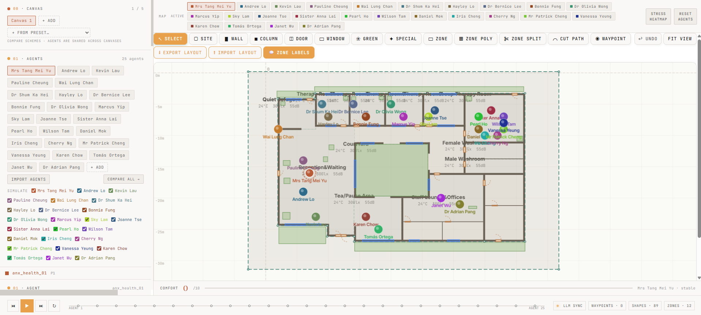

# SentiArch

**Good design doesn't lift the average — it makes difference visible.**

SentiArch is a multi-agent simulator that lets you walk a *diverse, simulated
population* through a building **before it's built**, and see how each person —
not an average person — actually experiences the space.

It combines two things architecture has never been able to hold at once:
**engineering calculation** (thermal comfort, geometry, enclosure) and
**lived human experience** (personality, anxiety, role, time spent in the room),
the second of which is simulated by an LLM grounded in the first.

> HKU Master of Architecture thesis · research prototype · MIT-licensed

<!-- TODO: replace with your Vercel URL once deployed -->
**▸ [Live demo](#)  ·  [2-min walkthrough video](#)**




---

## Why this matters

Architects design for an *average* user — average height, average reaction,
average needs. But no one is average. The same waiting room is **torture** to an
anxious patient, **rest** to a shift nurse, and a **workspace** to a cleaner.
Designers design for the snapshot; occupants live in the duration.

Today that gap is closed by intuition and one imagined user. SentiArch makes
that intuition **verifiable**: simulate 25 different people moving through your
plan, and read where the design quietly fails the people it forgot.

**Who it's for**

- **Architecture & interior studios** — a pre-handover evaluation surface for
  healthcare, eldercare, workplace, and transit spaces where comfort and stress
  carry real clinical or commercial weight.
- **Wellness / ESG-driven developers** — evidence for how a layout affects
  occupant stress, not just energy.
- **Researchers** — an open framework at the intersection of environmental
  psychology, building science, and LLM agent simulation.

---

## How it works

Each simulated occupant is described across **five dimensions**:

| Dimension | What it captures | How it's evaluated |
|---|---|---|
| **Spatial** | distance to wall/window, enclosure | calculated (geometry) |
| **Physiological** | thermal comfort, body state | **100% calculated** (PMV/PPD + empirical studies) |
| **Psychological** | MBTI personality, ASI-3 anxiety sensitivity, conditions | hybrid: scale → multiplier, LLM → felt nuance |
| **Temporal** | 10-minute visitor vs 5-day patient | calculated carry-over + simulated |
| **Objective** | why they're in the room (patient / staff / companion) | drives tolerance thresholds |

A **deterministic rule layer** ([`rules.ts`](client/src/lib/rules.ts)) fires
threshold-based triggers (e.g. perceived noise ≥ 75 dB) *before* any LLM call,
so the narrative is always grounded in real sensor values rather than vibes.

On top of the calculation sit **three LLM layers**:

1. **Translation** — turn a calculated number into a sentence a human would say.
2. **Simulation** — the heart of the method. No equation links "being a patient"
   to "tolerance for noise," or MBTI to spatial perception. Those linkages live
   only in how humans have *written* about experience; the LLM has compressed
   that, and we ask it to reach into that compression — not translation, not
   retrieval, not invention, but **simulation grounded in compressed human
   experience**.
3. **God's-eye critique** — read all 25 agents at once and surface patterns no
   single agent could see. The LLM as a design critic.

---

## Selected findings

- **The "clinic" label alone dropped comfort from 4.85 → 4.40.** Just naming the
  program made the simulator internalise the anxiety of waiting for a doctor —
  evidence it behaves like a real evaluation surface, not a sycophant.
- **Comfortable environments widen variance.** Harsh spaces flatten everyone to
  the same misery; comfortable ones let individual difference become visible.
- **Face-to-face geometry is a cross-program stressor** — except art therapy,
  where a shared gaze on the *object* breaks direct eye contact.

---

## Tech stack

React 19 · TypeScript · Three.js / React Three Fiber · @xyflow/react ·
Tailwind · Vite · Express · deployed on Vercel.

The floor-plan, stress heatmap, and comfort scores are computed entirely from
the engine (PMV/PPD + rules) and need **no API key**. Only the LLM layers
(felt-dimension scoring + narration) call a model, and they use **BYOK — bring
your own key**: enter a **DeepSeek** or **OpenAI** key on the Settings page (it
is stored only in your browser and forwarded via the [`api/llm.ts`](api/llm.ts)
proxy with each of your own requests), or run a local **Ollama** for free. The
hosted demo ships **no key**, so the host is never billed for visitors' usage.

## Run it locally

```bash
pnpm install
pnpm dev
```

Then open the app → **Open Prototype** to run the multi-agent simulator, or the
**Mental Health Centre Demo** to drag 25 agents onto a floor plan for live,
engine-grounded readings. The heatmap and comfort scores work immediately with
no key; for the LLM narration, set a key (or Ollama URL) on the **Settings**
page. For local dev you can instead drop a `DEEPSEEK_API_KEY` / `OPENAI_API_KEY`
into `.env.local` (copy `.env.local.example`) and the proxy will use it as a
fallback.

---

## Status & honest limitations

This is **preliminary research**, not a validated product — and that framing is
deliberate:

- Psychological scoring is **LLM-simulated**, not yet empirically validated.
- Temporal carry-over between rooms is preliminary.
- The spatial taxonomy is not finalised.
- People groups are **illustrative**, not a statistically representative sample.
- Layer-2 literature citations are model-generated and pending verification.

What the project demonstrates is the **framing and the method** — that half of
what we want to know about a space is calculable, and the other half can be
*simulated* rather than guessed. The validation of each piece is the next step.

## License

[MIT](LICENSE) — © George (HKU MArch). Built as a thesis; shared so others can
build on the framing.
